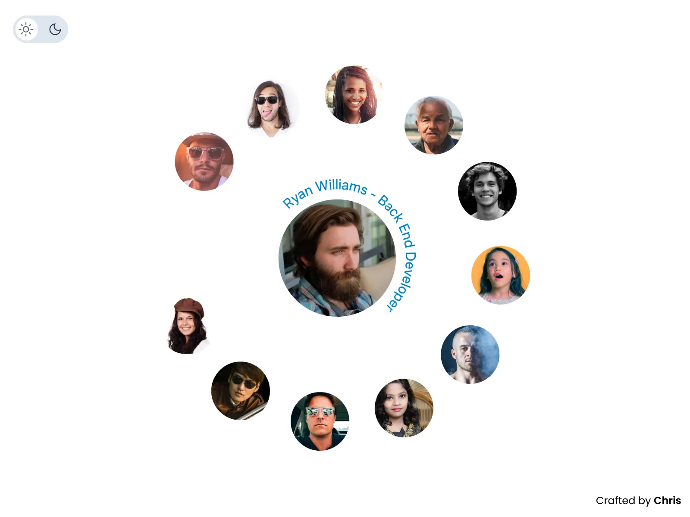

# Details of the Challenge

**Team Circle**

Start with this design and transform it into a functional project using HTML, CSS, and JavaScript.

If you want to go the extra mile, expand upon it, and integrate your unique touch by adding animations and interactivity.

Prioritize creativity over pixel-perfect accuracy and showcase your developer ingenuity.

- I have found this YT video quite educational [CSS Circular Image Rotate Animation Effects](https://youtu.be/0NhQIKZSUHo)
- transform/transform origin - [CSS Animation 13 - transform origin](https://youtu.be/UOqQMpyLd28)
- circular text = [How to make rounded text using css and javascript](https://youtu.be/5SHQbbUCgkk)
